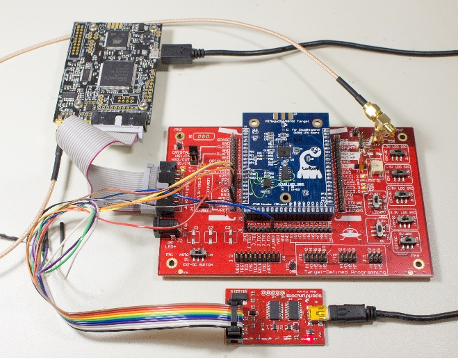
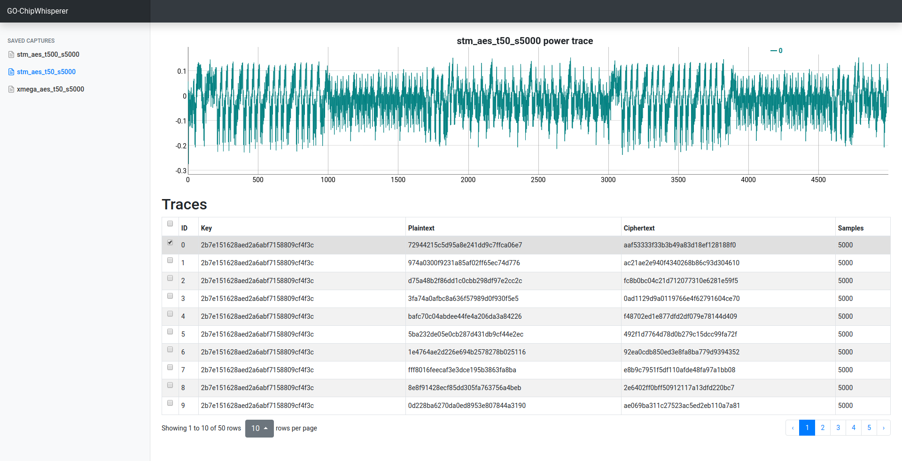
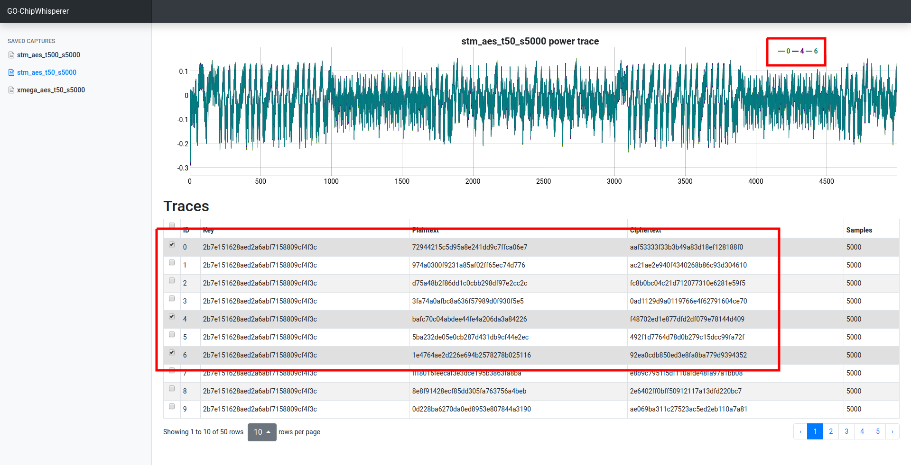
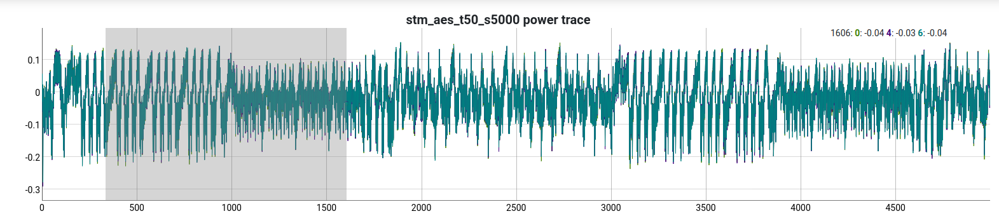
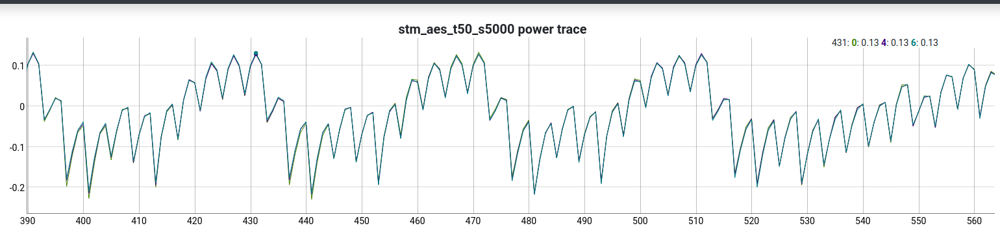
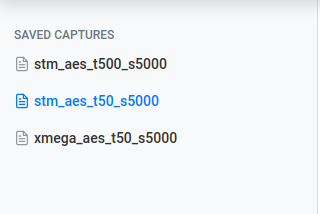

# GO - ChipWhisperer

## About

[ChipWhisperer](https://newae.com/tools/chipwhisperer/) is an open platform for
embedded hardware security research. `CW` was developed by Colin O'flynn.




`gocw` is a re-implementation of `CW`
[software stack](https://github.com/newaetech/chipwhisperer/), written in go.

`gocw` main features:

*   Clean interface to CW capture device.
*   Self contained flash programmers for XMEGA and STM32F targets.
*   Web based UI to view captured power traces.
*   Efficient implementation of several power-analysis algorithms (DPA/CPA/Templates)
    using [gonum](https://www.gonum.org/).

## Setup

1.   Get external git repositories:

```shell
$ git submodule init
$ git submodule update
```

2.   Get package dependencies:

```shell
$ go get -d ./...
```

3.   Generate enum strings, mocks, static file resources:

```shell
$ go get -u golang.org/x/tools/cmd/stringer
$ go get -u github.com/omeid/go-resources/cmd/resources
$ go get -u github.com/golang/mock/gomock
$ go install github.com/golang/mock/mockgen
$ go generate ./hardware ./...
$ go test github.com/google/gocw
```

4.   Build firmware files. See CW [wiki](https://wiki.newae.com/Main_Page) for
     information on how to install the required toolchains.

```shell
$ mkdir build
$ cd build

# For STM32 targets run the following:
build$ PLATFORM=CWLITEARM cmake ..

# For XMEGA targets run the following:
build$ PLATFORM=CWLITEXMEGA cmake ..

build$ make
```

## Smoke Tests

The tests under `tests/` are e2e integration tests that verify `gocw` stack is
working properly. Each test programs the target, sends requests over the serial
based communication protocol, and verifies the firmware returns the expected
output.

To run the tests, plugin `CW` device, and run:

```shell
$ go test ./tests/simple_serial_smoke_test.go -count 1 -v
$ go test ./tests/aes_smoke_test.go -count 1 -v
$ go test ./tests/ecdh_smoke_test.go -count 1 -v
```

## Power Analysis Process

The following demonstrates how to use `gocw` to mount a correlation power
analysis (CPA) on the first round of AES-128 running on the target device.

1.  Program the target device.

```shell
$ go run cmd/program.go -logtostderr -firmware build/firmware/tiny_aes.hex
```

2.  Capture 50 traces, 5000 samples per trace, starting from offset 0 from the
    trigger:

```shell
$ go run cmd/capture.go -logtostderr \
  -traces 50 -samples 5000 -offset 0 -output captures/aes_t50_s5000.json.gz
```

3.  Launch Web UI to view the captures:

```shell
$ go run viewer/server.go -port 8080 -dir captures
```

Browse to *http://localhost:8080*, and examine the power trace:



Load new traces by clicking on the rows in the traces window:



Zoom in by selecting a samples time region:





The web UI monitors the captures directory for changes. We can run the server
in the background `go run viewer/server.go&`, and new capture files will automatically
be displayed on the captures window.




4.  Run correlation power analysis to recover the key:

```shell
$ go run cmd/attack_sbox_cpa.go -logtostderr -input captures/aes_t50_s5000.json.gz
...attack_sbox_cpa.go:113] Loaded capture with 50 traces / 5000 samples per trace
...attack_sbox_cpa.go:165] Fully recovered key: 2b7e151628aed2a6abf7158809cf4f3c
```

## Implemented Attacks

*  [Correlation Power Analysis](cmd/attack_sbox_cpa.go) attacks the SBOX lookup of the first
   round of AES-128. Attack fully recovers the key from ~50 traces.

*  [Differential Power Analysis](cmd/attack_sbox_dpa.go) attacks the SBOX lookup of the first
   round of AES-128. Attack fully recovers the key from ~500 traces.

*  [ECDH Template Attack](cmd/ecdh_zero_point_template_attack.go) builds a power trace classifier
   that identifies when a EC multiplication operation resulted with a zero-coordinate point.
   Classifier successfully identifies traces in the validation set from training from ~150 traces.

## Supported Hardware

`gocw` was only tested on [ChipWhisperer-lite](https://wiki.newae.com/CW1173_ChipWhisperer-Lite)
with XMEGA and STM32F targets. Contributions for additional hardware support are welcome.

## Disclaimer

This is not an official Google product (experimental or otherwise), it is just
code that happens to be owned by Google.
